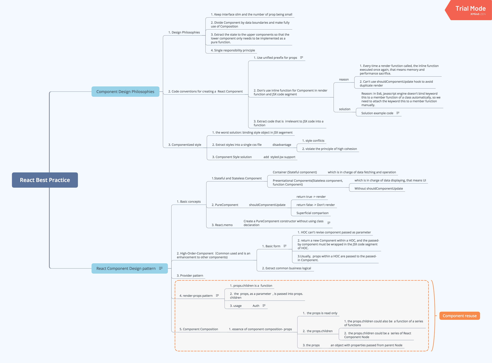
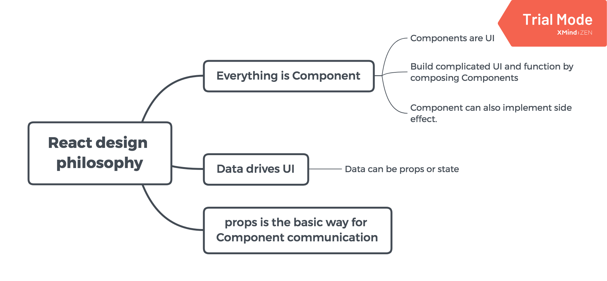

# Best Practice in React

## Contents

.

## Part One: Design philosophy of React

Three basic rules in React:

- Data drives UI

UI = f(data). Data includes `props` and `state`.

- Everything is Component in React

  - UI is `component.`
  - Build complicated function by nesting and composing components
  - Implement side effects by component

Netherless UI equals to `component`, but a component in React can also implement some side effect as well.

```javascript
class Beacon extends React.Component {
  render () {
    return null
  }

  componentDidMount() {
    const bean = new Image();
    beacon.src = 'https://domain.name/beacon.gif';
  }
}
```

- `props` is the basic way of component communication

We pass `props` from Parent Component to Child Component to share data among Child component and Parent component. For data shared globally, we use *Redux*.

**Summary**:

.

## Part Two: Best Practices in building React Component

### (1) How to build a React Component with clear APIs

**High cohesion, low coupling** is a principle for designing software systems, so is component design in React. In detail, for developing a React component, the laws are:

- Keep `props` small (Keep API small)
- Make full usage of composition and divide component by data boundaries
- Extract state to upper components and implement lower component as a pure function.

### (2) Implement a component

The perfect code should be lean, can work, and high performance.

Some tips for writing React components.

- **DON'T USE inline function in JSX**

```javascript
class ControlButtons extends React. Component {
  render() {
    <div className="ControlButtons">
      <button className="btn btn-reset" onClick={() => {/* TO DO SOMETHING */}}>Lap</button>
      <button className="btn btn-start" onClick={() => {/* TO DO SOMETHING */}}>Start</button>
    </div>
  }
}
```

There are three reasons for *DON'T USE inline function in JSX*:

- Every time a render function called, a new function created, which wastes performance;
- Can't avoid duplicated render via `shouldComponentUpdate`;

- Bind `this` to instance automatically by Array Function

```javascript
class ControlButtons extends React.Component {
  render() {
    <div className="ControlButtons">
      <button className="btn btn-reset" onClick={this.onLap}>Lap</button>
      <button className="btn btn-start" onClick={this.onStart}>Start</button>
    </div>
  }
  
  onLap = () => {
    // do something
  }
  onStart = () => {
    // do something
  }
}
```

- Use uniform prefix for `props`

```javascript
// function

onClick = () => {
  // do something
}
```

- Extract code that is  irrelevant to JSX code into a function

```javascript
import  React from 'react';
// ms2Time is a non-related code to JSX
import { ms2Time } from './utils';

const MajorClock = ({ milliseconds }) => {
  const timeValue = ms2Time(milliseconds);
  return (
    <div className="MajorClock">
      <h1>{timeValue}</h1>
    </div>
  )
}

export default MajorClock;
```

### (3): style in React

- Bind style property to dom element in JSX
- Import style file in React definition file
- Add styled-jsx support

## Part Three: Component Pattern

### 1. High Order Component

#### 1). Basic concepts of HOC

HOC solves a problem where a business logical repeatedly occurs and can't be extracted into a single component either.

**Name convention for HOC: using `with` as prefix**.

- A HOC example:

```javascript
const withSayingHi = (Component, ...others) => {
  const NewComponent = (props) => {
    return (
      <div className="WithSayingHi">
        <h3 className="tit">Hi!</h3>
        <Component {...props} />;
      </div>
    )
  };
  return NewComponent;
};
```

- Features of HOC:

- Pure function
- Return a Component
- In common, HOC should pass its `props` to the returned component in HOC.

- Another HOC example:

Component1:

```javascript
const LogoutButton = () => {
  if (getUserId()) {
    return ...; // 显示”退出登录“的JSX
  } else {
    return null;
  }
};
```

Component2:

```javascript
const ShoppintCart = () => {
  if (getUserId()) {
    return ...; // show cart
  } else {
    return null;
  }
};
```

For both `Component1` and `Component2`, there is a repeated code segment:

```javascript
if (getUserId()) {
  return ...; // show logout button
} else {
  return null;
}
```

which can be extracted as a HOC, `withLogin`:

```javascript
const withLogin = (Component) => {
  const NewComponent = (props) => {
    if (getUserId()) {
      return <Component {...props} />;
    } else {
      return null;
    }
  }

  return NewComponent;
};
```

By `withLogin`,

```javascript
const LogoutButton = withLogin((props) => {
  return ...; // show logout button
});

const ShoppingCart = withLogin(() => {
  return ...; // show cart
});
```

#### 2). Advanced usage of HOC

- Pass multiple params to HOC
- HOC Chaining.

### 2. Render `props` (function as child)

*Render `props`* pattern expects children property is a function.

```javascript
const RenderAll = (props) => {
  return (
    <React.Fragment>
      {props.children(props)}
    </React.Fragment>  
  )
}
```

**Extention**: Any `props` can work as a function

```javascript
const Auth= (props) => {
  const userName = getUserName();

  if (userName) {
    const allProps = {userName, ...props};
    return (
      <React.Fragment>
        {props.login(allProps)}
      </React.Fragment>
    );
  } else {
    <React.Fragment>
      {props.nologin(props)}
    </React.Fragment>
  }
};
```

In fact, `render props` is a Dependency Injection to React.

### 3. Provider Pattern

`Provider Pattern` is a solution to avoid multiple level `props` passing. There are two roles in `Provider Pattern` which are

- Provider
- Customer

`React-Redux` is a React Redux lib based on `Provider Pattern`

## Readings

1. Some principles for software design: [https://coolshell.cn/articles/4535.html](https://coolshell.cn/articles/4535.html)
2. React In Practice: [https://juejin.im/book/5ba42844f265da0a8a6aa5e9](https://juejin.im/book/5ba42844f265da0a8a6aa5e9)
