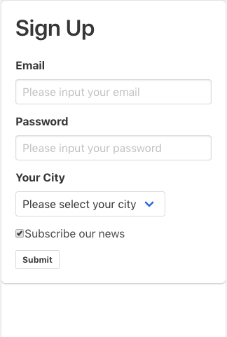

# Form In React

## About this demo



A basic form demo for ReactJs and form styles from bulma.

There are three examples in this folder, which are

- Input
- Select
- Form

Tutorials can be found at:

- [https://reactjs.org/docs/forms.html](https://reactjs.org/docs/forms.html)
- [https://bulma.io/documentation/form/](https://bulma.io/documentation/form/)

Ant design is an mature React UI framework, if you want to know more about how its Form component works, you can click [https://github.com/ant-design/ant-design/tree/master/components/form](https://github.com/ant-design/ant-design/tree/master/components/form)

## Form

Form has its default behavior, like auto reload webpage when submit its data.

### Stop auto reload  page behavior

```javascript
onSubmit = (e) => {
  e.preventDefault()
  /*
    some other codes
  */
}
```

### Controlled Components

An input form element whose value is controlled by React in this way is called a **“controlled component”.**

## Enhancement for this demo can be done

- add delay support for from filed change
- add form validation
