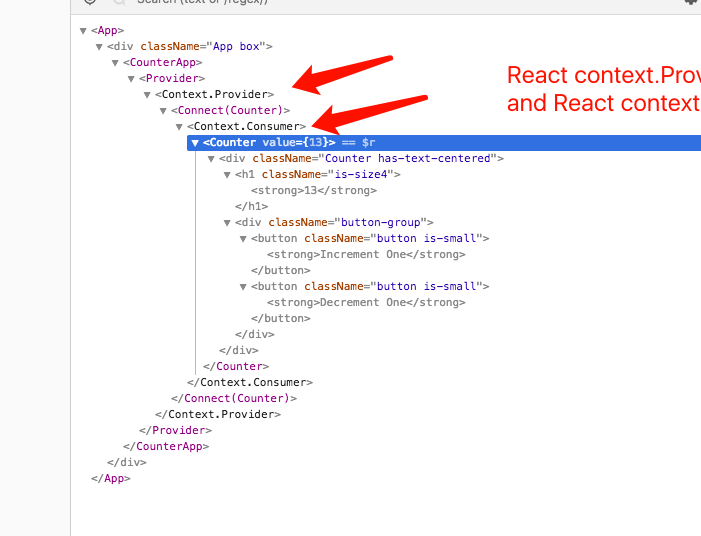

# react-redux

**Tutorial** [http://www.ruanyifeng.com/blog/2016/09/redux_tutorial_part_three_react-redux.html](http://www.ruanyifeng.com/blog/2016/09/redux_tutorial_part_three_react-redux.html)

**officia site** [https://react-redux.js.org](https://react-redux.js.org)

## Theory



- UI component
- container component

## API

- provide store

```javascript
import React, { Component } from 'react'
import { Provider } from 'react-redux'
import { store } from './store'

export default class CounterApp extends Component {
  render() {
    return (
      <Provider store={store}>
        <!--some code-->
      </Provider>
    )
  }
}
```

- connect store to UI component

```javascript
import React from 'react'
import { PropTypes } from 'prop-types'
import { connect } from 'react-redux'
import * as actions from './actions'

const Counter = (props) => {
  const {
    value,
    onIncrementOne,
    onDecrementOne
  } = props
  return (
    <div className="Counter has-text-centered">
      <h1 className="is-size4"><strong>{value}</strong></h1>
      <div className="button-group">
        <button className="button is-small" onClick={onIncrementOne}><strong>Increment One</strong></button>
        <button className="button is-small" onClick={onDecrementOne}><strong>Decrement One</strong></button>
      </div>
    </div>
  )
}

Counter.proptypes = {
  value: PropTypes.number.isRequired,
  onIncrementOne: PropTypes.func.isRequired,
  onDecrementOne: PropTypes.func.isRequired
}

// map state to props
const mapStateToProps = (state, ownProps) => {
  return {
    value: state.value
  }
}

// map dispatch to props
const mapDispatchToProps = (dispatch, ownProps) => {
  return {
    onIncrementOne: () => {
      dispatch(actions.incrementOne())
    },
    onDecrementOne: () => {
      dispatch(actions.decrementOne())
    }
  }
}

export default connect(
  mapStateToProps,
  mapDispatchToProps
)(Counter)

```
