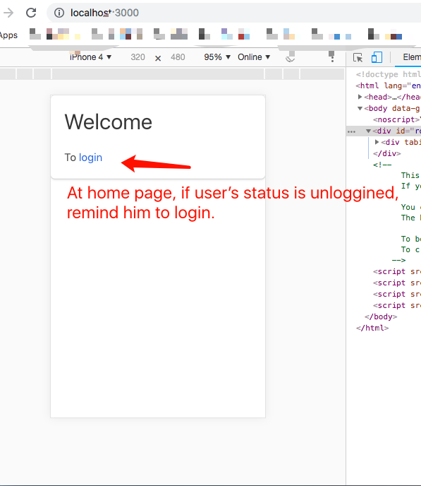

# An auth example

## Function

- Home page

**Before** sign in


**After** sign in


- Dashboard

**Before** sign in


**After** sign in


- Login page


## How to achive this function

- cache user info into localStorage to auto load if user logined and visit webpage after a long-time from */* or *dashboard*

In *rematch/models.js* we have the following code:

```javascript
doLoginAndCacheInfo(payload, rootState) {
      const {
        username
      } = payload
      localStorage.setItem('username', username)
      dispatch.user.doLogin(payload)
    },
```

- Before going to any page, we load user info from localStorage

In *rematch/index.js*, we have the following code:

```javscript
store.dispatch({
  type: 'user/loadUserInfo'
})
```

- At login page, we add  **getDerivedStateFromProps** to go to *dashboard* page automatically and avoid re-logining in if user status is authed.

```javascript
  static getDerivedStateFromProps(props, state) {
    if(props.auth) {
      navigate('/dashboard')
    }
    return null
  }
```

- Clear login info after sign out

In *rematch/models.js* we have the following code:

```javascript
signOutAndClearCache(payload, rootState) {
  localStorage.removeItem('username')
  dispatch.user.unLogin(payload)
  setTimeout(() => {
    navigate('/login')
  }, 0)
},
```

